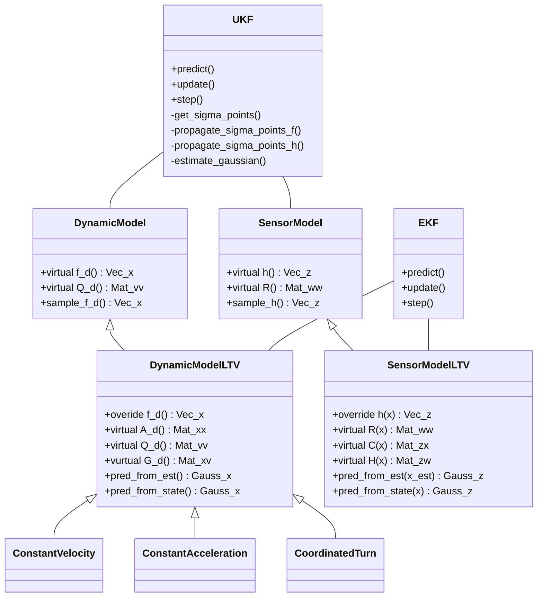

<!-- Can be viewed in vscode -->

```mermaid
classDiagram

    DynamicModel <|-- DynamicModelLTV
    SensorModel <|-- SensorModelLTV
    DynamicModelLTV <|-- ConstantVelocity
    DynamicModelLTV <|-- ConstantAcceleration
    DynamicModelLTV <|-- CoordinatedTurn

    EKF -- DynamicModelLTV
    EKF -- SensorModelLTV

    UKF -- DynamicModel
    UKF -- SensorModel


    class EKF{
        +predict()
        +update()
        +step()
    }

    class UKF{
        +predict()
        +update()
        +step()
        -get_sigma_points()
        -propagate_sigma_points_f()
        -propagate_sigma_points_h()
        -estimate_gaussian()
    }

    class DynamicModel{
        +virtual f_d() Vec_x
        +virtual Q_d() Mat_vv
        +sample_f_d() Vec_x
    }

    class SensorModel{
        +virtual h() Vec_z
        +virtual R() Mat_ww
        +sample_h() Vec_z
    }

    class DynamicModelLTV {
        +overide f_d() Vec_x
        +virtual A_d() Mat_xx
        +virtual Q_d() Mat_vv
        +vurtual G_d() Mat_xv
        +pred_from_est() Gauss_x
        +pred_from_state() Gauss_x
    }

    class SensorModelLTV {
        +override h(x) Vec_z
        +virtual R(x) Mat_ww
        +virtual C(x) Mat_zx
        +virtual H(x) Mat_zw
        +pred_from_est(x_est) Gauss_z
        +pred_from_state(x) Gauss_z
    }

    class ConstantVelocity
    class CoordinatedTurn
    class ConstantAcceleration

```
<!-- Can be edited at https://mermaid.live/edit -->