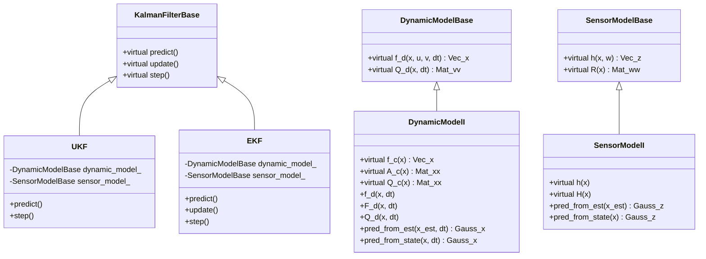

```mermaid
classDiagram
    KalmanFilterBase <|-- UKF
    KalmanFilterBase <|-- EKF
    DynamicModelBase <|-- DynamicModelI
    SensorModelBase <|-- SensorModelI


    class KalmanFilterBase{
      +virtual predict()
      +virtual update()
      +virtual step()
    }

    class EKF{
        -DynamicModelBase dynamic_model_
        -SensorModelBase sensor_model_
        +predict()
        +update()
        +step()
    }

    class UKF{
        -DynamicModelBase dynamic_model_
        -SensorModelBase sensor_model_
        +predict()
        +step()
    }

    class DynamicModelBase{
        +virtual f_d(x, u, v, dt) Vec_x
        +virtual Q_d(x, dt) Mat_vv
    }

    class SensorModelBase{
        +virtual h(x, w) Vec_z
        +virtual R(x) Mat_ww
    }

    class DynamicModelI {
        +virtual f_c(x) Vec_x
        +virtual A_c(x) Mat_xx
        +virtual Q_c(x) Mat_xx
        +f_d(x, dt)
        +F_d(x, dt)
        +Q_d(x, dt)
        +pred_from_est(x_est, dt) Gauss_x
        +pred_from_state(x, dt) Gauss_x
    }

    class SensorModelI {
        +virtual h(x)
        +virtual H(x)
        +pred_from_est(x_est) Gauss_z
        +pred_from_state(x) Gauss_z
    }
```
<!-- Can be edited at https://mermaid.live/edit -->