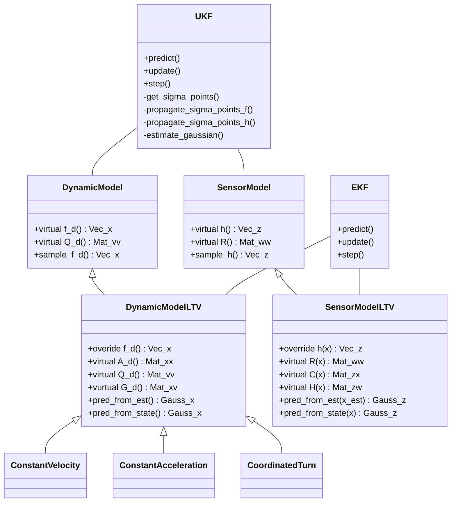

# vortex-filtering
## Models
Contains the models used in the filters. The models are implemented as classes that inherit from the `DynamicModelBase` class or `SensorModelBase` class. The models are implemented in the `models` namespace. [More info](include/vortex_filtering/models/README.md)

## Filters
Contains the filters. The filters are implemented as classes that inherit from the `KalmanFilterBase` class. The filters are implemented in the `filters` namespace. [More info](include/vortex_filtering/filters/README.md)

## Class Diagram

