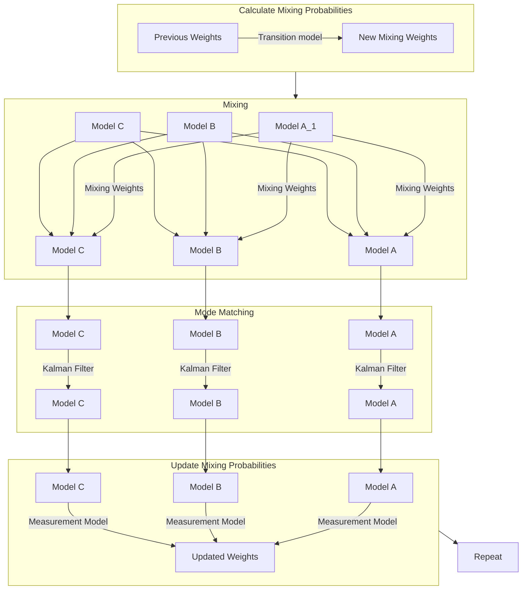

# Filters
This folder contains various filters for state estimation. Th

All classes and functions are under the namespace `vortex::filters`.

Here is a great intro to Kalman filters in general: [Kalman and Bayesian Filters in Python](

## Overview
- [`ekf.hpp`](ekf.hpp) contains the EKF filter
- [`ukf.hpp`](ukf.hpp) contains the UKF filter
- [`imm_filter.hpp`](imm_filter.hpp) contains the IMM filter

### EKF
This class represents an [Extended Kalman Filter](https://en.wikipedia.org/wiki/Extended_Kalman_filter). It is a template class with parameters `DynamicModelT` and `SensorModelT` for the dynamic model and sensor model respectively. It works with models derived from `vortex::models::DynamicModelLTV` and `vortex::models::SensorModelLTV`. All methods are static, so there is no need to create an instance of this class.

#### Usage


#### Example
```cpp
#include <vortex_filtering/vortex_filtering.hpp>

// Create aliases for the models and EKF (optional)
using DynModT = vortex::models::ConstantVelocity;
using SensModT = vortex::models::RangeBearingSensor;

using EKF = vortex::filters::EKF<ConstantVelocity, RangeBearing>;


// Create the dynamic model and sensor model
double std_vel = 1.0;

double std_range = 0.1;
double std_bearing = 0.1;

auto dynamic_model = std::make_shared<DynModT>(std_vel);
auto sensor_model = std::make_shared<SensModT>(std_range, std_bearing);

// Get the type aliases you need from the dynamic models and sensor models (optional)
using DynModI  = typename DynamicModelT::DynModI;
using SensModI = typename SensorModelT::SensModI
using Gauss_x  = typename DynmodI::Gauss_x;
using Vec_z    = typename SensModI::Vec_z;

// Initial estimate
Gauss_x x_est_prev{50, 60, 0, 0};

// Measurement
Vec_z z_meas{48, 65};

// Estimate the next state
auto [x_est_upd, x_est_pred, z_est_pred] = EKF::step(dynamic_model, sensor_model, dt, x_est_prev, z_meas);
```

### UKF

[UKF explained](https://towardsdatascience.com/the-unscented-kalman-filter-anything-ekf-can-do-i-can-do-it-better-ce7c773cf88d)

The UKF can take any model derived from `vortex::models::DynamicModel` and `vortex::models::SensorModel`. All methods are static, so there is no need to create an instance of this class.

#### Usage
The EKF and UKF share mostly the same interface and so it can be used for everything the EKF can. The main purpose of it is that it works with nonlinear models. 

The UKF parameters $\alpha$, $\beta$ and $\kappa$ are set to 1.0, 2.0 and 0.0 by default. These can be changed by passing them as template arguments after the models. I don't know a reason for why you would want to change these, but the option is there anyways.

#### Example
```cpp
// Same as the EKF but with a U instead of an E
```

### IMM Filter
This class represents an [Interacting Multiple Model Filter](https://github.com/rlabbe/Kalman-and-Bayesian-Filters-in-Python/blob/master/14-Adaptive-Filtering.ipynb). It is a template class with parameters `SensModT` and `ImmModT` for the sensor model and IMM model respectively. All methods are static, so there is no need to create an instance of this class.

The IMM filter supports both linear and nonlinear models, using EKF for linear and UKF for nonlinear models derived from `vortex::models::DynamicModel` and `vortex::models::SensorModel`.

#### Theory
The IMM filter is a filter that can switch between different models based on the probability of each model being the correct one. It does this by running multiple models in parallel and mixing the estimates from each model together. 

The workings of the IMM filter can be summarized in the following four steps:
1. Calculate Mixing Probabilities
2. Mixing
3. Mode Matching
4. Update Mixing Probabilities

which can be visualized in the following flowchart and will be explained in more detail below.



##### 1 - Calculate Mixing Probabilities
The mixing probabilities are the probabilities of each model being the correct one. These are calculated based on the previous mixing probabilities and the transition model. The transition model is a matrix that specifies the probability of switching from one model to another and is specified when creating the [IMM model](../models/README.md#imm-model).

##### 2 - The Mixing Step
The mixing step is the most important part of the IMM filter. It is the step where the estimates from the different models are combined and mixed together. Essentially, the IMM filter calculates the next state for each model based on a weighted average of the estimates from the other models. The weights are determined by the probability of each model being the correct one.

__The Mixing of Non-Comparable States__

In order to estimate the states when mixing the models together, the IMM filter needs to know which states are comparable to each other. For example if the states of the models are

$$
\begin{align*}
\text{Model A:} \quad \mathbb{x} &= \begin{bmatrix} p_x & p_y \end{bmatrix}^\top \\
\text{Model B:} \quad \mathbb{x} &= \begin{bmatrix} p_x & p_y & v_x & v_y \end{bmatrix}^\top \\
\text{Model C:} \quad \mathbb{x} &= \begin{bmatrix} p_x & p_y & v_x & v_y & \theta \end{bmatrix}^\top \\
\text{Model D:} \quad \mathbb{x} &= \begin{bmatrix} p_x & p_y & v_x & v_y & a_x & a_y \end{bmatrix}^\top \\
\end{align*}
$$

then the IMM filter needs to know that the states $p_x$ and $p_y$ are comparable between all models, but the states $\theta$ and $a_x$ aren't. This is done by specifying the names of the states in the [IMM model](../models/README.md#imm-model). The similar states are mixed as normal as specified in Edmund Brekkes sensor fusion book, but the states that are not comparable are mixed using the method outlined in [this paper](https://www.researchgate.net/publication/289707032_Systematic_approach_to_IMM_mixing_for_unequal_dimension_states). 

The method in the paper works as long as the minimum and maximum value a state can take is fed to the mixing function. Essentially a uniform distribution is created for the states that are not comparable and the mixing is done using the mean and variance of this distribution as state estimates for the missing states.

For example when mixing the states of model A into model B, the states $v_x$ and $v_y$ are missing. The mixing function then creates a uniform distribution for these states from the minimum and maximum values of the $v_x$ and $v_y$ states. The mean and variance of this distribution is then used as the state estimates for the missing states before the mixing is done. If the 

This feature is the main reason the implementation is so much more complex than for the EKF and UKF. 

##### 3 - Mode Matching
The mode matching step is where the Kalman filter is run for each model. This is done in the same way as for the EKF and UKF, but for each model separately.

##### 4 - Update Mixing Probabilities
The mixing probabilities are updated based on the measurements and the estimates from the mode matching step. This is done using the measurement model and the estimates from the mode matching step as well as the previous mixing probabilities.
#### Usage
The IMM filter is used in the same way as the EKF and UKF. The main difference is that the IMM filter needs initial state probabilities as well as an initial state estimate. And instead of returning a single state estimate, it returns a tuple of state estimates and weights for each model.

#### Example
```cpp
#include <vortex_filtering/vortex_filtering.hpp>

// Create aliases for the models and IMM filter (optional)
using CP = vortex::models::ConstantPosition;
using CV = vortex::models::ConstantVelocity;
using CT = vortex::models::CoordinatedTurn;

using IMM = vortex::filters::IMMFilter<CP, CV, CT>;

// Specify holding times and switching probabilities
Eigen::Vector3d hold_times{10.0, 10.0, 10.0};
Eigen::Matrix3d switch_probs{
    {0.0, 0.5, 0.5},
    {0.5, 0.0, 0.5},
    {0.5, 0.5, 0.0}
};

double std_pos = 0.1, std_vel = 0.1, std_turn = 0.1;

// Specify the state names of the models
using ST = vortex::models::StateType;
const std::array cp_names{ST::pos, ST::pos};
const std::array cv_names{ST::pos, ST::pos, ST::vel, ST::vel};
const std::array ct_names{ST::pos, ST::pos, ST::vel, ST::vel, ST::turn};

// Create the IMM model and sensor model
IMM imm_model(hold_times, switch_probs, 
              {CP(std_pos), cp_names}, 
              {CV(std_vel), cv_names}, 
              {CT(std_vel, std_turn), ct_names});

using SensModT = vortex::models::IdentitySensorModel;
auto sensor_model = std::make_shared<SensModT>(0.1);

// Specify min and max values for the states that are not comparable
vortex::models::StateMap min_max_values{
    {ST::vel, {-10, 10}},
    {ST::turn, {-M_PI, M_PI}}
};

// Initial state probabilities
Eigen::Vector3d model_weights{0.3, 0.3, 0.4}; // Must sum to 1

// Initial state estimates
std::tuple<Gauss2d, Gauss4d, Gauss5d> x_est_prevs = {
    {50, 60},
    {50, 60, 0, 0},
    {50, 60, 0, 0, 0.1}
};

// Measurement
Vec2d z_meas{48, 65};

// Estimate the next state
using ImmFilter = vortex::filters::IMMFilter<SensModT, IMM>;
auto [weights_upd, x_est_upds, x_est_preds, z_est_preds] = 
    IMM::step(imm_model, sensor_model, dt, x_est_prevs, z_meas, model_weights, states_min_max);
```