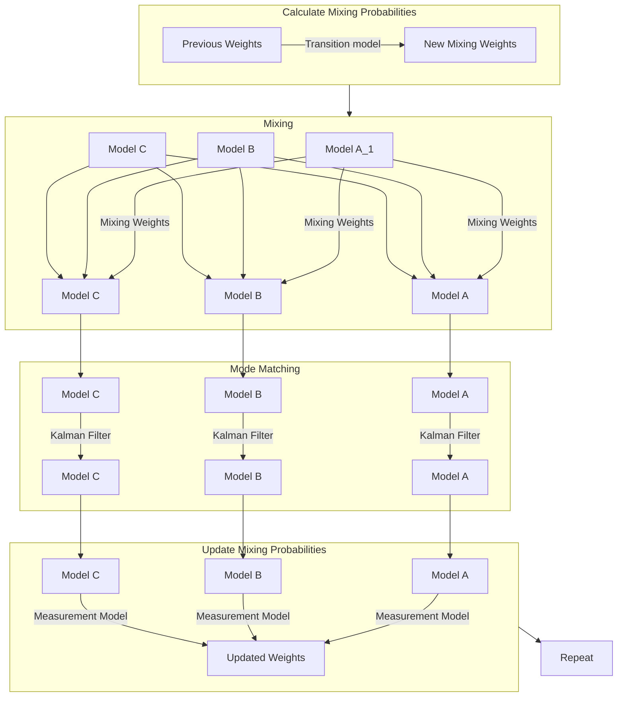

# Filters
This folder contains various filters for state estimation and target tracking. The filters are based on the Kalman filter and its extensions, and are designed to work with the models in the `vortex::models` namespace.

All classes and functions are under the namespace `vortex::filters`.

Here is a great intro to Kalman filters in general: [Kalman and Bayesian Filters in Python](https://github.com/rlabbe/Kalman-and-Bayesian-Filters-in-Python/blob/master/00-Preface.ipynb)

## Overview
- [`ekf.hpp`](ekf.hpp) contains the EKF
- [`ukf.hpp`](ukf.hpp) contains the UKF
- [`imm_filter.hpp`](imm_filter.hpp) contains the IMM filter
- [`pdaf.hpp`](pdaf.hpp) contains the pdaf
- [`ipda.hpp`](ipda.hpp) contains the ipda filter

### EKF
This class represents an [Extended Kalman Filter](https://en.wikipedia.org/wiki/Extended_Kalman_filter). It is a template class with parameters `DynamicModelT` and `SensorModelT` for the dynamic model and sensor model respectively. It works with models derived from `vortex::models::DynamicModelLTV` and `vortex::models::SensorModelLTV`. All methods are static, so there is no need to create an instance of this class.

#### Usage


#### Example
```cpp
#include <vortex_filtering/vortex_filtering.hpp>

// Create aliases for the models and EKF (optional)
using DynModT = vortex::models::ConstantVelocity;
using SensModT = vortex::models::RangeBearingSensor;

using EKF = vortex::filters::EKF<ConstantVelocity, RangeBearing>;


// Create the dynamic model and sensor model
double std_vel = 1.0;

double std_range = 0.1;
double std_bearing = 0.1;

auto dynamic_model = std::make_shared<DynModT>(std_vel);
auto sensor_model = std::make_shared<SensModT>(std_range, std_bearing);

// Get the sizes of the state and measurement vectors
constexpr int N_DIM_x = DynModT::N_DIM_x;
constexpr int N_DIM_z = SensModT::N_DIM_z;

// Get all types used in the models
using T = vortex::Types_xz<N_DIM_x, N_DIM_z>;

// Initial estimate
typename T::Gauss_x x_est_prev{50, 60, 0, 0};

// Measurement
typename T::Vec_z z_meas{48, 65};

// Estimate the next state
auto [x_est_upd, x_est_pred, z_est_pred] = EKF::step(dynamic_model, sensor_model, dt, x_est_prev, z_meas);
```

### UKF

[UKF explained](https://towardsdatascience.com/the-unscented-kalman-filter-anything-ekf-can-do-i-can-do-it-better-ce7c773cf88d)

The UKF can take any model derived from `vortex::models::DynamicModel` and `vortex::models::SensorModel`. All methods are static, so there is no need to create an instance of this class.

#### Usage
The EKF and UKF share mostly the same interface and so it can be used for everything the EKF can. The main purpose of it is that it works with nonlinear models.

The UKF parameters $\alpha$, $\beta$ and $\kappa$ are set to 1.0, 2.0 and 0.0 by default. These can be changed by passing them as template arguments after the models. I don't know a reason for why you would want to change these, but the option is there anyways.

#### Example
```cpp
// Same as the EKF but with a U instead of an E
```

### IMM Filter
This class represents an [Interacting Multiple Model Filter](https://github.com/rlabbe/Kalman-and-Bayesian-Filters-in-Python/blob/master/14-Adaptive-Filtering.ipynb). It is a template class with parameters `SensModT` and `ImmModT` for the sensor model and IMM model respectively. All methods are static, so there is no need to create an instance of this class.

The IMM filter supports both linear and nonlinear models, using EKF for linear and UKF for nonlinear models derived from `vortex::models::DynamicModel` and `vortex::models::SensorModel`.

#### Theory
The IMM filter is a filter that can switch between different models based on the probability of each model being the correct one. It does this by running multiple models in parallel and mixing the estimates from each model together.

The workings of the IMM filter can be summarized in the following four steps:
1. Calculate Mixing Probabilities
2. Mixing
3. Mode Matching
4. Update Mixing Probabilities

which can be visualized in the following flowchart and will be explained in more detail below.



##### 1 - Calculate Mixing Probabilities
The mixing probabilities are the probabilities of each model being the correct one. These are calculated based on the previous mixing probabilities and the transition model. The transition model is a matrix that specifies the probability of switching from one model to another and is specified when creating the [IMM model](../models/README.md#imm-model).

##### 2 - The Mixing Step
The mixing step is the most important part of the IMM filter. It is the step where the estimates from the different models are combined and mixed together. Essentially, the IMM filter calculates the next state for each model based on a weighted average of the estimates from the other models. The weights are determined by the probability of each model being the correct one.

__The Mixing of Non-Comparable States__

In order to estimate the states when mixing the models together, the IMM filter needs to know which states are comparable to each other. For example if the states of the models are

$$
\begin{align*}
\text{Model A:} \quad \mathbb{x} &= \begin{bmatrix} p_x & p_y \end{bmatrix}^\top \\
\text{Model B:} \quad \mathbb{x} &= \begin{bmatrix} p_x & p_y & v_x & v_y \end{bmatrix}^\top \\
\text{Model C:} \quad \mathbb{x} &= \begin{bmatrix} p_x & p_y & v_x & v_y & \theta \end{bmatrix}^\top \\
\text{Model D:} \quad \mathbb{x} &= \begin{bmatrix} p_x & p_y & v_x & v_y & a_x & a_y \end{bmatrix}^\top \\
\end{align*}
$$

then the IMM filter needs to know that the states $p_x$ and $p_y$ are comparable between all models, but the states $\theta$ and $a_x$ aren't. This is done by specifying the names of the states in the [IMM model](../models/README.md#imm-model). The similar states are mixed as normal as specified in Edmund Brekkes sensor fusion book, but the states that are not comparable are mixed using the method outlined in [this paper](https://www.researchgate.net/publication/289707032_Systematic_approach_to_IMM_mixing_for_unequal_dimension_states).

The method in the paper works as long as the minimum and maximum value a state can take is fed to the mixing function. Essentially a uniform distribution is created for the states that are not comparable and the mixing is done using the mean and variance of this distribution as state estimates for the missing states.

For example when mixing the states of model A into model B, the states $v_x$ and $v_y$ are missing. The mixing function then creates a uniform distribution for these states from the minimum and maximum values of the $v_x$ and $v_y$ states. The mean and variance of this distribution is then used as the state estimates for the missing states before the mixing is done. If the min and max isn't provided however, the mixing function will copy the state estimates from the other model as is.

> This feature is the main reason the implementation is so much more complex than for the EKF and UKF.

##### 3 - Mode Matching
The mode matching step is where the Kalman filter is run for each model. This is done in the same way as for the EKF and UKF, but for each model separately.

##### 4 - Update Mixing Probabilities
The mixing probabilities are updated based on the measurements and the estimates from the mode matching step. This is done using the measurement model and the estimates from the mode matching step as well as the previous mixing probabilities.

#### Usage
The IMM filter is used in the same way as the EKF and UKF. The main difference is that the IMM filter needs initial state probabilities as well as an initial state estimate. And instead of returning a single state estimate, it returns a tuple of state estimates and weights for each model.

#### Example
```cpp
#include <vortex_filtering/vortex_filtering.hpp>

// Create aliases for the models and IMM filter (optional)
using CP = vortex::models::ConstantPosition;
using CV = vortex::models::ConstantVelocity;
using CT = vortex::models::CoordinatedTurn;

using IMM = vortex::filters::IMMFilter<CP, CV, CT>;

// Specify holding times and switching probabilities
Eigen::Vector3d hold_times{10.0, 10.0, 10.0};
Eigen::Matrix3d switch_probs{
    {0.0, 0.5, 0.5},
    {0.5, 0.0, 0.5},
    {0.5, 0.5, 0.0}
};

double std_pos = 0.1, std_vel = 0.1, std_turn = 0.1;

// Specify the state names of the models
using ST = vortex::models::StateType;
const std::array cp_names{ST::pos, ST::pos};
const std::array cv_names{ST::pos, ST::pos, ST::vel, ST::vel};
const std::array ct_names{ST::pos, ST::pos, ST::vel, ST::vel, ST::turn};

/* Note: for the models in this example, you can use the already defined state names instead:
    auto cp_names = CP::StateNames;
    auto cv_names = CV::StateNames;
    auto ct_names = CT::StateNames;
But for custom models, you will have to define the state names yourself.
*/

// Create the IMM model and sensor model
IMM imm_model(hold_times, switch_probs,
              {CP(std_pos), cp_names},
              {CV(std_vel), cv_names},
              {CT(std_vel, std_turn), ct_names});

using SensModT = vortex::models::IdentitySensorModel;
auto sensor_model = std::make_shared<SensModT>(0.1);

// Specify min and max values for the states that are not comparable
vortex::models::StateMap min_max_values{
    {ST::vel, {-10, 10}},
    {ST::turn, {-std::numbers::pi, std::numbers::pi}}
};

// Initial state probabilities
Eigen::Vector3d model_weights{0.3, 0.3, 0.4}; // Must sum to 1

// Initial state estimates
std::tuple<Gauss2d, Gauss4d, Gauss5d> x_est_prevs = {
    {50, 60},
    {50, 60, 0, 0},
    {50, 60, 0, 0, 0.1}
};

// Measurement
Vec2d z_meas{48, 65};

// Estimate the next state
using ImmFilter = vortex::filters::IMMFilter<SensModT, IMM>;
auto [weights_upd, x_est_upds, x_est_preds, z_est_preds] =
    IMM::step(imm_model, sensor_model, dt, x_est_prevs, z_meas, model_weights, states_min_max);
```

### PDAF

This class represents the **P**robalistic **D**ata **A**ssociation **F**ilter. It is implemented according to the textbook "Fundamentals of Sensor Fusion" (Chapter 7) by *Edmund Brekke*. The class works as a "toolbox" to provide the usage of the PDAF. Other classes can use the given functions to implement the PDAF for their particular tasks.

However, the PDAF is mainly used by us for target tracking. Additionally, PDAF is **single**-target tracking. That means that all other measurements (besides the tracked target) are considered to be clutter. If multiple targets should be tracked, multiple single-target trackers can be initialized. Notable here is that the PDAF itself doesn't have to be initialized. In fact, it can't be initialized. It just provides static functions. Therefore, you can use the namespace and, with it, the PDAF functions.

The main usage of the PDAF is the function **step()**. It will predict the next state of a given target. The step function will need several parameters to work:
* Dynamic model,
* sensor model,
* current time step,
* x estimation (the last known state of the target),
* z measurements,
* and config (which is a struct that holds:)
    * mahalanobis threshold
    * minimum gate threshold
    * maximum gate threshold
    * probability of detection
    * clutter intensity

#### Dynamic/Sensor Models

If you want to use the PDAF for your measurements, you have to define how your measurements behave. That is what the models are for. The **dynamic** model (or transition model) describes how states change over time. A common example of this would be velocity. The **sensor** model is a bit less intuitive and difficult to explain. Let's consider the following example:
We want to measure the temperature inside a rocket drive. We know in theory, how the temperature should change over time. That would be our dynamic model. We basically want to compare this model with the actual measurements and find a good estimated final value for the current state of the temperature in the drive. It's a bit of a design choice if you trust the model or the actual measurements. Both could be accurate or wrong. The main problem is that we can't put sensors directly into the drive (they would melt and be destroyed instantly). Therefore, we put a sensor outside the rocket and measure the temperature there. Here, we have to know how the temperature we measure corresponds to the actual temperature inside the drive. In other words, the temperature that we measure is not the actual value of what we want to measure. But we know which value corresponds to the measurent value (a measured value of X degrees outside the drive corresponds to Y degrees inside the drive). This is given by the sensor model. If you want to get a better explanation of those models, I suggest using the Textbook "Artificial Intelligence: A Modern Approach, 4th Edition" by *Stuart Russell* and *Peter Norvig*. The book explains those models in Chapter 14 - *Probabilistic Reasoning Over Time*. All in all, you have to define those models and pass them to the function. Under the name space **vortex::models**, you can find simple predefined models to use:

```c++
// example how to define models using vortex::models
using DynMod = vortex::models::ConstantVelocity;
using SensorMod = vortex::models::IdentitySensorModel<4, 2>;
// example how to use PDAF in practice
using PDAF = vortex::filter::PDAF<DynMod, SensorMod>;
auto [x_final, inside, outside, x_pred, z_pred, x_updated] = PDAF::step(parameters...)
```

#### Previous State Estimate
The step function needs to know what the previous state was. Based on this state, the dynamic model will be used. The model will give us a predicted new state. This state will be compared to the actual measurements. The previous state must be a Gaussian distribution.

#### Measurements
The perceived measurements. This parameter consists of an `Eigen::Vector`. It should hold all perceived measurements. (The dimension must be the same as defined in the models.)

#### Basic Principle
This will be a short description of what is happening inside the step function. For a more clear and specific explanation of the steps of the PDAF please look into the recommended textbooks.
* The step function will first use the dynamic model to calculate the next state (only considering the given model). Then the sensor model is used to convert the predicted state into the measurement space. That means to get the value, we would measure with our sensor if the perceived state is like the predicted state (of the dynamic model). Concerning our rocket example: We predict the drive temperature with the dynamic model and use the sensor model to convert the drive temperature to the temperature we would measure from the outside.
Both of those steps are done in one line of code by using the EKF explained earlier.
* The second step is the gating of the measurements. This is to exclude measurements that are too far away. So, we can assume that they are definitely clutter, and we won't use them. The **mahalanobis_threshold** parameter is used to define the threshold used for gating. This value will scale the covariance of the predicted state. All measurements inside this will be considered.
* The next step is the update states step. All measurements inside the gate will be compared to the predicted state estimate (by the dynamic model). This results in a Gaussian distribution for all of these measurements.
* In the last step, the weighted average of estimated Gaussian distributions will be calculated. This weighted average will be the final output of the PDAF and is considered to be the current state estimate. Therefore, it will be the previous state estimate in the next iteration.

It is highly recommended to look into "Fundamentals of Sensor Fusion" (Chapter 7) by *Edmund Brekke*. You will find there a visualization of the explained process, which makes it easier to understand. Also, the implemented tests for the PDAF will plot the given outcome. This will also help to understand what is happening.
In order for the test to work with visualization you have to uncomment following statement in the CMakeLists.txt of *vortex-filtering*.
```
if(BUILD_TESTING)
  # add_compile_definitions(GNUPLOT_ENABLE=1) <- uncomment this
  add_subdirectory(test)
endif()
```

#### Other Parameters

* Current time step: The current iteration.
* Probability of detection: This is the probability that we will detect the target. Defining this, for example, with 0.8 means that there is a 20% chance that no measurement is assumed to be the target. (In this case, we will only take the dynamic model into consideration)
* Clutter intensity: Here you can define how much clutter you expect within the region.

#### Returns

The step()-function will return return the new estimated state and all outputs of the substeps. Returning those in addition, enables us to visualize the outputs of the PDAF.

### IPDA

IPDA stand for **I**integrated **P**robabilistic **D**ata **A**ssociation. It uses extra steps in addition to the regular PDAF. The PDAF is extended to also include a probability value which describes the target's existence. The main reason for this is to evaluate not only the state of the target but also the probability of existence dependent on the previous states.
IPDA works in terms of usage the same way the PDAF works. The class provides a static function (also called *step*). You can use this function by referencing the namespace.

```c++
using ConstantVelocity = vortex::models::ConstantVelocity;
using IdentitySensorModel = vortex::models::IdentitySensorModel<4, 2>;
using IPDA = vortex::filter::IPDA<ConstantVelocity, IdentitySensorModel>;

auto [x_final, existence_pred, inside, outside, x_pred, z_pred, x_updated] = IPDA::step(parameters...);
```

#### Parameters
The parameters of the step() function are mainly the same as those of the PDAF. However, two parameters are added:
* Existence Probability: This is the survival estimate of the previous state estimate (corresponding to x_estimate). It describes the target existence, which we also want to estimate for the current state.
* Probability of survival: This is a general hyperparameter that defines how likely a target is to survive. This parameter shouldn't be confused with the probability of detection. If no measurement is considered to correspond to the target, we consider the dynamic model. The track still *survives*. If a target *dies*, it can't come back, and the track will be deleted.

#### Returns
In addition to all the return parameters of the PDAF the IPDA will return the estimated existence prediction for the current state (corresponding to x_final).
